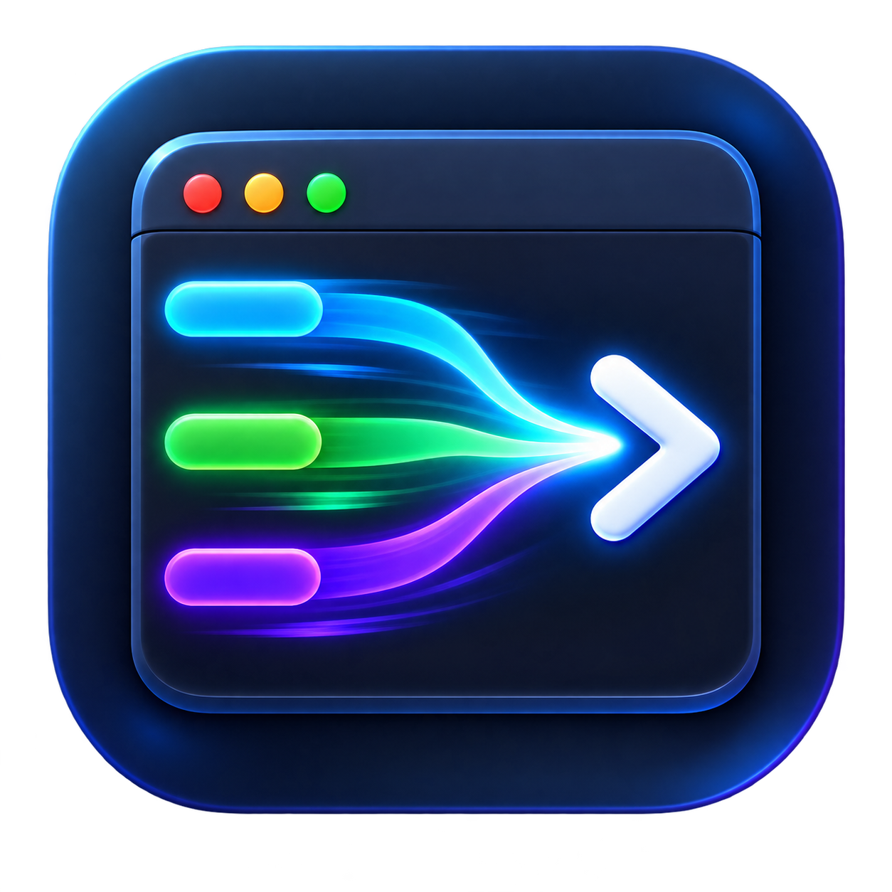

<div align="center">



# liney-win

**A terminal workspace for Windows** — keep your repositories, worktrees, splits,
and tabs in a single window.

A Windows take on macOS [liney](https://github.com/everettjf/liney). Terminal core
is **Ghostty's [libghostty-vt](https://github.com/ghostty-org/ghostty)**; the UI is
fully self-drawn **Win32 / Direct2D**. Builds with **MSVC + Zig**.

[](https://github.com/everettjf/liney-win/releases)
[](https://github.com/everettjf/liney-win/releases)


[](LICENSE)

**English** · [中文](README.zh-CN.md)

</div>

<p align="center">
  
</p>

---

## Why liney-win?

A normal terminal gives you tabs. **liney-win gives you a workspace.** Your git
repos and their worktrees live in the sidebar, every project carries its own icon,
the folder tree follows whatever pane you're typing in, and your whole split layout
comes back exactly as you left it. It's the multi-repo, multi-pane cockpit that
Windows never shipped — drawn from scratch, so it starts instantly and depends on
nothing but the OS.

## ✨ Features

**🖥️ Terminal** — powered by **Ghostty's libghostty-vt** core
- Full VT parsing: cursor / erase / scroll regions / insert-delete, SGR
  16/256/truecolor rendered with **bold/italic/underline/inverse/faint/strike**,
  UTF-8, **wide (CJK) glyphs**, grapheme clusters
- **Scrollback** (wheel · `Shift+PgUp`) with **reflow** of long lines on resize
- **Alternate screen** — vim / less / `git log` just work, and the **mouse wheel
  scrolls them** (arrow keys are sent when the alt screen is active)
- **Cursor** — DECSCUSR **block / bar / underline** shapes (vim mode-switching),
  **blinking** per terminal modes, hollow when the pane is unfocused, OSC 12 color
- **Mouse reporting** — vim (`:set mouse=a`) / htop / mc receive clicks, drags and
  the wheel (SGR + legacy protocols); hold **Shift** to select text locally instead
- OSC-driven **window title** and **cwd tracking** (the file tree follows your shell)
- **Selection + copy/paste** — **buffer-anchored** (the highlight stays on its text
  while you scroll or output streams in), drag-select, **double-click word /
  triple-click line**, **copy-on-select** (opt-in), right-click menu,
  `Ctrl+V` / `Shift+Insert` paste, bracketed paste, an opt-out **multi-line paste
  confirm**; **IME** (CJK) with the candidate window at the cursor
- **Find** (`Ctrl+F`) — highlights every match in view and **searches the whole
  scrollback**: `Enter`/`F3` jump match-to-match up through history,
  `Shift+Enter` walks back down
- **Fonts** — pick any monospace family + size in **Settings**, or zoom via
  `Ctrl +/-/0` / **`Ctrl+Wheel`**; all remembered across launches
- **Themes** — **7 built-in presets** (Emerald / Azure / Violet Night, Amber
  Dark, Rose Dark, Slate Frost, Paper Light), a live-preview theme dropdown,
  and a **custom accent color** picker for the active-pane divider / tab —
  plus full fg/bg + 16-color ANSI overrides for power users
- **Unix tools** — with Git for Windows installed, `ls` / `cat` / `grep` / `rm` /
  `sed` / `awk` / … work in any shell

**🗂️ Workspace** — liney's differentiator
- Tabs (with a **× close button** and right-click **close to the right / left /
  others / all**) + binary **splits** (drag dividers to resize, drag tabs to
  reorder), `Alt+Arrows` to move focus. Crowded tab strips keep the active tab
  visible; every open tab is searchable from `Ctrl+Shift+P`.
- Split layouts show an active-pane count/close control. Closing one pane, the
  whole tab, other panes, or other tabs is also available by name in the
  command palette, with consolidated running-command warnings.
- **Pane zoom** (`Ctrl+Shift+Z`) maximizes the focused pane; **Equalize**
  (`Ctrl+Shift+E`) evens them out — so a deep split layout stays workable
- A **folder + Git repository** sidebar with per-project icons. Ordinary
  folders open directly; Git repositories expand into worktrees with branch,
  ahead/behind and changed-file status.
- **Manage projects**: the WORKSPACE **+** adds either kind. Git projects expose
  **New worktree… / Review changes / Refresh Git status**; every project offers
  **Open / Open folder in File Explorer / Set icon… / Remove from workspace**.
  Removing an
  auto-discovered repository stays persisted across rescans.
- A right-side **folder tree** that follows the focused pane
- **SSH** hosts and **agent** sessions, each with its own icon, one click to open
- **Layout persistence** — tabs + split tree + per-pane cwd restored next launch

**⚡ Built-in tooling**
- A top-right **☰ menu**: settings · scheduled shutdown · command history ·
  updates · a compact support/diagnostics submenu
- **Settings… dialog** — click-to-configure shell, font & size, theme &
  accent, scrollback, workspace root, copy-on-select, paste warning, Unix
  tools; applied live and saved without disturbing hand-edited keys
  (config.json stays fully editable too)
- **Keep awake** (`Ctrl+Shift+K`) — block system/display sleep for **1 / 2 / 3 /
  6 / 24 hours or until turned off**, with the remaining time in the menu
- **Scheduled shutdown** — ask Windows to shut down after **1 / 2 / 3 / 6 / 12 /
  24 hours**, or cancel a pending shutdown from the same menu
- **Git**: `Ctrl+Shift+L/G` open `git log` / `git diff` in a new tab
- **Notifications**: a `liney notify` CLI + OSC `9`/`777` → Windows tray balloons
- **Lifecycle hooks** on session start/exit and app exit
- **Verified auto-update** from GitHub releases: quiet startup checks (optional
  in Settings) plus manual checks with `Ctrl+Shift+U`
- **Opt-in AI command help**: explain the last command block and propose a fix
  through OpenAI, Codex CLI, or a custom compatible API. Requests redact common
  secrets, exclude full history, classify command risk, and always require
  confirmation before execution.
- **Reliability tooling**: atomic configuration recovery, rotating diagnostics,
  bounded crash dumps, one-click privacy-safe diagnostic ZIP export, abnormal
  exit tab/pane/cwd recovery, restartable exited shells, transactional update
  rollback, signed-install downgrade protection, and reproducible Ghostty pinning
- **Command blocks** from OSC 133: jump, copy command/output, rerun, bookmark,
  and inspect exit status/duration from the pane menu
- **Searchable local command history**: bounded, secret-redacted, and inserts a
  selected result for review without executing it
- **Optional per-project PowerShell history**: when enabled, PSReadLine writes
  separate history files for each project/worktree; the default keeps the
  user's normal global PowerShell history
- **Named workspace snapshots** and isolated Agent worktrees with Git/test/review
  actions; Agent sessions remain available after exit for inspection
- **Fuzzy command palette** (`Ctrl+Shift+P`) searches actions, shell profiles,
  workspaces, worktrees, recent projects, SSH hosts and agents. Results expose
  categories and unavailable-action reasons; use `tabs:`, `pane:`, `git:`,
  `ssh:` or `agent:` to filter.
- **Flexible tabs and panes**: pin, rename or duplicate tabs; swap panes or move
  a pane into its own tab, with tab metadata preserved in workspace snapshots

## 📸 Screenshots

### Split panes

Keep multiple shells visible, move focus with the keyboard, and resize the layout
without leaving the workspace.


### Command palette

Search tabs, panes, Git actions, worktrees, SSH hosts, agents, and settings from
one keyboard-first interface.


## 📦 Install

**Download** — from the [Releases](https://github.com/everettjf/liney-win/releases) page:

| File | Description |
|---|---|
| `liney-setup.exe` | Installer — per-user, no admin, Start Menu + uninstall |
| `liney-portable.zip` | Portable — unzip and run `Liney.exe` |

**Supported systems:** 64-bit Windows 10 version 1809 or newer, and Windows 11.
The installer and portable zip include their required MSVC runtime DLLs.

Current GitHub release binaries are not code-signed, so Windows SmartScreen may
show an **Unknown publisher** warning. Download only from this repository's
Releases page and verify the included `SHA256SUMS.txt` when needed.

**Build from source** — Windows 10 1809+/11, with:
- **Visual Studio 2022** Desktop C++ (bundles CMake ≥ 3.20 + Ninja)
- **[Zig 0.15.2](https://ziglang.org/download/)** on PATH — the terminal core is
  built from Ghostty via Zig

```powershell
# in the "x64 Native Tools Command Prompt for VS 2022", with zig on PATH
powershell -ExecutionPolicy Bypass -File tools\build.ps1
.\build-ghostty\Liney.exe
```

`tools\build.ps1` configures + builds and points Zig's cache at the build drive
(a Zig 0.15.2 quirk panics when the source and cache are on different drives).
The first build fetches Ghostty and compiles `libghostty-vt`, so it takes a while;
`ghostty-vt.dll` is copied next to the exe automatically.

> Prefer raw CMake? `cmake -B build -G Ninja -DCMAKE_BUILD_TYPE=Release && cmake --build build`
> — but set `ZIG_GLOBAL_CACHE_DIR` to a folder on the build drive first.

## ⌨️ Shortcuts

| Key | Action |
|---|---|
| `Ctrl+Shift+T` / `Ctrl+Shift+W` | New tab / close current pane |
| `Alt+D` / `Shift+Alt+D` | Split right (left∣right) / split down (top/bottom) |
| `Ctrl+Tab` / `Ctrl+Shift+Tab` | Next / previous tab |
| `Ctrl+1`…`Ctrl+8` / `Ctrl+9` | Jump to tab N / last tab |
| `Alt+Arrows` | Move focus between split panes |
| `Alt+B` / `Alt+N` / `Alt+L` | Sidebar / new tab / all tabs |
| `Alt+O` / `Alt+K` / `Alt+M` | Open folder menu / keep-awake menu / main menu |
| `Ctrl+Shift+B` / `Ctrl+Shift+F` | Toggle the left sidebar / right files panel |
| `Ctrl+Shift+C` / `Ctrl+Shift+V` | Copy selection / paste |
| `Ctrl+C` / `Ctrl+V` | Copy when text is selected (else ^C) / paste |
| `Shift+Insert` / `Ctrl+Insert` | Paste / copy selection |
| `Ctrl+Shift+A` | Select all (scrollback included) |
| `Ctrl+F` · `Enter`/`F3` · `Shift+Enter` · `Esc` | Find · older match (searches scrollback) · newer match · close |
| `Shift`+click/drag | Select locally while an app (vim/htop) captures the mouse |
| `Ctrl++` / `Ctrl+-` / `Ctrl+0` · `Ctrl+Wheel` | Zoom font in / out / reset · zoom |
| `Ctrl+Shift+L` / `Ctrl+Shift+G` | `git log` / `git diff` for the current repo |
| `Ctrl+Shift+K` | Keep awake (block sleep) on / off |
| `Ctrl+Shift+U` | Check for & install updates |
| Wheel · `Shift+PgUp/PgDn/Home/End` | Scroll through scrollback |
| Mouse | Switch tab · focus pane · expand repo · open worktree/SSH/agent · drag to select (auto-scrolls past the edge) · double/triple-click word/line · right-click a pane for copy/paste/find · drag to resize / reorder · right-click a worktree to manage |

## ⚙️ Configuration

The first run writes `%USERPROFILE%\.liney\config.json` (mirroring macOS liney's
`~/.liney/`; full sample in [`config.example.json`](config.example.json)):

```json
{
  "shell": "cmd.exe",
  "fontFamily": "Cascadia Mono",
  "fontSize": 16,
  "fontLigatures": false,
  "workspaceRoot": "",
  "unixTools": true,
  "copyOnSelect": false,
  "multiLinePasteWarning": true,
  "powerShellHistoryPerProject": false,
  "ai": { "provider": "off", "model": "gpt-5.6-luna", "endpoint": "https://api.openai.com/v1/responses", "includeCwd": false },
  "hooks": { "sessionStart": "", "sessionExit": "", "appExit": "" },
  "sshHosts": ["user@host"],
  "agents": [{ "name": "agent", "command": "claude", "cwd": "" }],
  "projectIcons": { "my-repo": "builtin:rocket" },
  "theme": { "background": "#102840", "foreground": "#e8e8d0", "palette": ["#000000", "..."] }
}
```

| Key | Meaning |
|---|---|
| `shell` | Shell for new tabs (`powershell.exe` / `pwsh.exe` / `wsl.exe`; `wsl tmux` for tmux) |
| `workspaceRoot` | Directory scanned for repos; empty disables discovery and shows explicit projects only |
| `projects` | Explicit ordinary folders or Git repositories shown in Workspace |
| `workspaceExclusions` | Auto-discovered repositories intentionally hidden from Workspace |
| `keybindings` | Object mapping action names to chords such as `Ctrl+Shift+P`; duplicate chords are reported and ignored |
| `unixTools` | Append Git's `usr\bin` to PATH so `ls`/`cat`/`grep`/… work |
| `copyOnSelect` | Copy to the clipboard as soon as a selection ends (PuTTY-style) |
| `multiLinePasteWarning` | Confirm before pasting text with line breaks (each break runs as Enter) |
| `powerShellHistoryPerProject` | Opt into separate PSReadLine history files under `%USERPROFILE%\.liney\powershell-history` for each project/worktree; default `false` preserves the shell's normal history path |
| `fontFamily` / `fontSize` | Terminal font; the ☰ → **Font…** picker, `Ctrl +/-/0` and `Ctrl+Wheel` update and persist them |
| `fontLigatures` | Opt-in DirectWrite shaping for common programming operators; off by default for strict cell compatibility |
| `scrollback` | History lines retained per session (default 10000) |
| `sshHosts` / `agents` | Entries in the sidebar SSH / AGENTS sections |
| `projectIcons` | Per-project built-in sidebar icon IDs; new projects receive one at random |
| `theme` | Terminal fg/bg + the 16-color ANSI palette |
| `hooks` | Commands run on session start/exit and app exit |
| `ai.provider` | `off` (default), `openai`, `codex`, or `custom` |
| `ai.model` | Provider model; the OpenAI default is `gpt-5.6-luna` |
| `ai.endpoint` | HTTPS endpoint used only by the `custom` provider |
| `ai.includeCwd` | Include the active directory in explicit AI requests (off by default) |

AI is opt-in. Choose a provider in Settings, then right-click a completed
semantic command block and select **Explain last command with AI…**. OpenAI
uses `OPENAI_API_KEY`; custom compatible APIs use `LINEY_AI_API_KEY`; Codex CLI
uses the user's existing Codex sign-in. Keys are read from the process
environment and are never stored by Liney. The request includes only the last
command block after redaction, never the full terminal history.

Custom shortcut action names include `newTab`, `splitRight`, `splitDown`,
`toggleSidebar`, `toggleFiles`, `zoomPane`, `equalize`, `find`, `settings`,
`workspaceSnapshots`, `checkUpdates`, `keepAwake`, `commandPalette`,
`newWindow`, `newAdminWindow`, `searchHistory`, `exportDiagnostics`,
`renameTab`, `pinTab`, `duplicateTab`, `swapPane`, `movePane`, `detachPane`,
`closePane`, `closeTab`, `closeOtherPanes`, and `closeOtherTabs`.

The window layout is saved to `%USERPROFILE%\.liney\layout.json` and restored on
the next launch.

## 🔔 `liney` CLI & notifications

A companion CLI `Liney.exe` ships with the app; run it in a pane to drive the
terminal over OSC (mirrors macOS liney's `liney notify`):

```
liney notify <body>            # Windows tray notification
liney notify <title> <body>
liney title  <text>            # set the tab/window title
liney agent-status <state>     # running | waiting | needs-input | done | failed
```

Put `Liney.exe` on PATH and `liney notify "done"` pings you when a long task
finishes. The terminal also parses OSC `0/2` (title), `7` (cwd), `9` and
`777;notify` (notifications). Agent adapters can emit status through the
companion command so the workspace sidebar reports meaningful task state
without binding Liney to a particular AI provider.

Inline images support the bounded iTerm2 `OSC 1337;File=...` subset. Requests
must set `inline=1`; bare numeric `width` and `height` are interpreted as
terminal cells. PNG, JPEG and GIF are accepted up to 3 MiB decoded, dimensions
are capped at 200×200 cells, and each session retains at most 16 images.

## 🏗️ Architecture

```
keyboard/mouse → Window (workspace orchestration) → routes to the focused pane
                 ↑ composes sidebar · tab strip · split tree · files panel · toolbar
TerminalSession = Terminal + ConPty + Grid
   ConPty      — Windows pseudoconsole (spawn shell, read/write, resize)
   Terminal    — wraps libghostty-vt (Ghostty's VT engine): PTY bytes → render
                 snapshot → Grid; selection / find / mouse encoding via its C API
   D2DRenderer — Direct2D/DirectWrite draws chrome and color fonts; ordinary
                 glyphs rasterize once into a D3D11 atlas and draw in one
                 tinted shader batch per frame; opt-in operator runs use
                 DirectWrite ligature shaping
```

Source map in [`src/`](src). Design / research notes: [`RESEARCH.md`](RESEARCH.md),
[`ALT_PLAN_SELFBUILT.md`](ALT_PLAN_SELFBUILT.md),
[`TERMINAL_LANDSCAPE.md`](TERMINAL_LANDSCAPE.md); rendering plan:
[`RENDERING.md`](RENDERING.md). Quality gates and reproducible local benchmark
evidence live in [`docs/QUALITY_GATES.md`](docs/QUALITY_GATES.md) and
[`docs/BENCHMARKS.md`](docs/BENCHMARKS.md).

## 🗺️ Roadmap

Done & remaining items (with a macOS-liney comparison) live in
[`ROADMAP.md`](ROADMAP.md); per-release changes in [`CHANGELOG.md`](CHANGELOG.md).
Still pending: SFTP remote file tree and native tmux control-mode.
(Mouse reporting needs a ConPTY that passes mouse-mode
requests through — Windows 11 / recent Windows 10.)

## 🤝 Contributing

Issues and PRs are welcome — see [`CONTRIBUTING.md`](CONTRIBUTING.md) for the full
setup. The one thing to get right: the build needs **Zig 0.15.2** (not 0.16.x) to
compile the libghostty-vt core. The codebase is plain C++20 + Win32 + Direct2D,
split into small, cohesive files (see [`src/`](src)); please match the surrounding
style.

## 🙏 Acknowledgements

- [liney](https://github.com/everettjf/liney) by [@everettjf](https://github.com/everettjf) — the macOS original this follows, and the source of the app icon.
- [Ghostty](https://github.com/ghostty-org/ghostty) — provides `libghostty-vt`, liney-win's terminal core (built from Ghostty via Zig).

## 📄 License

[Apache-2.0](LICENSE) — same as liney.
